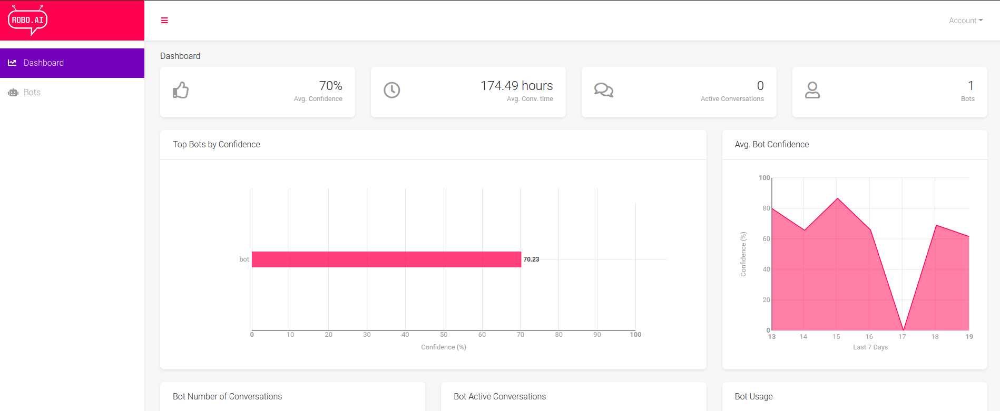
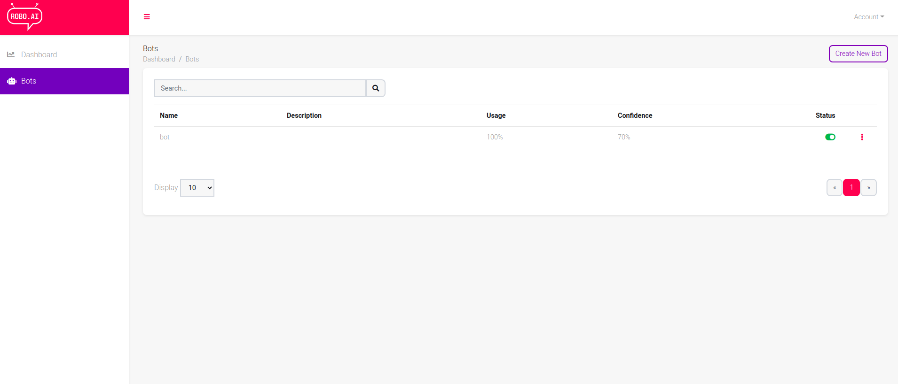
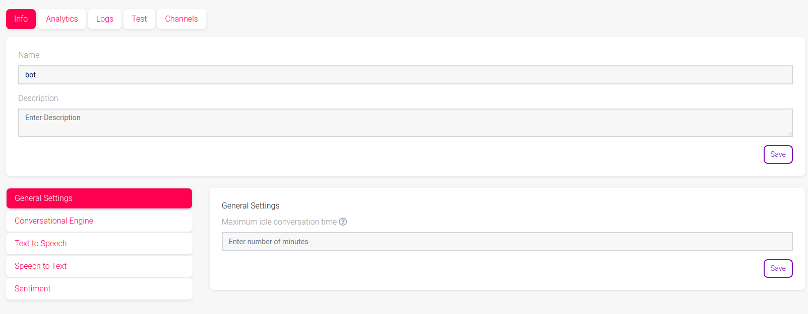
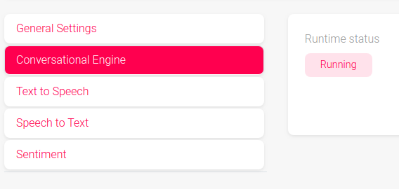
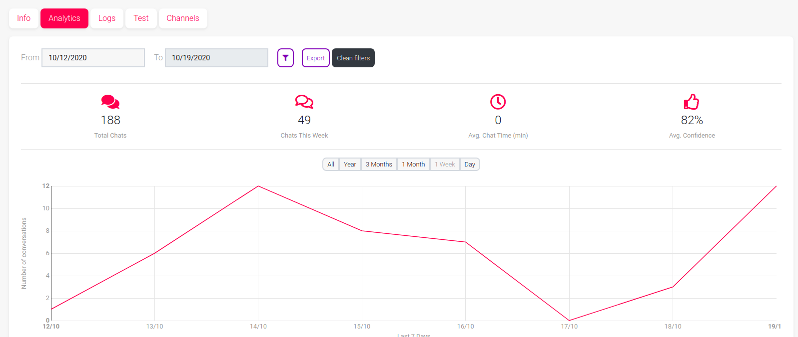
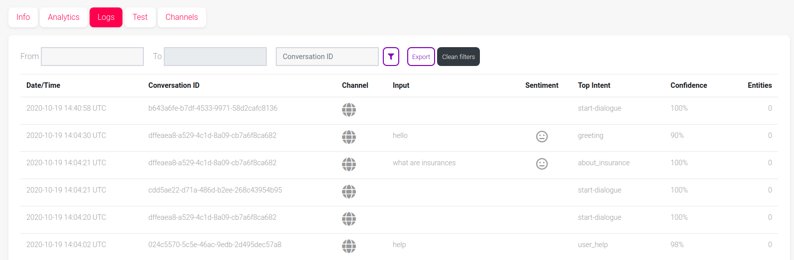
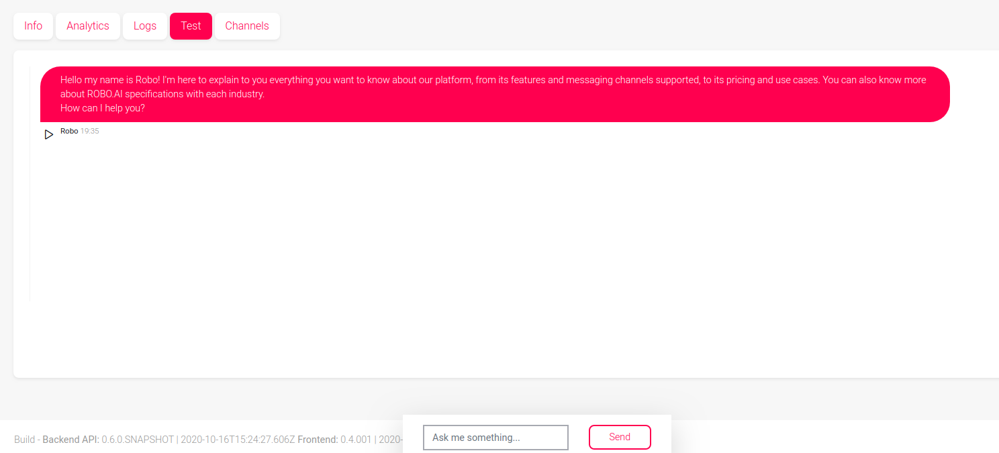
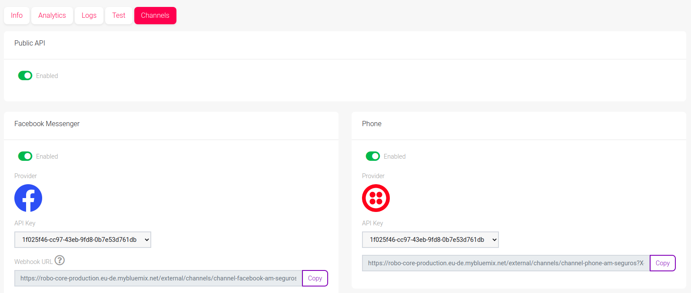
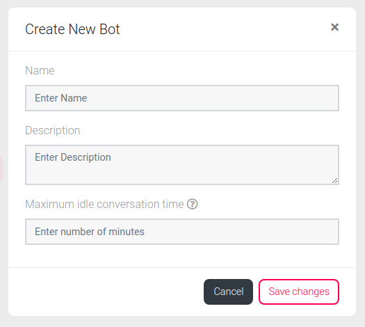
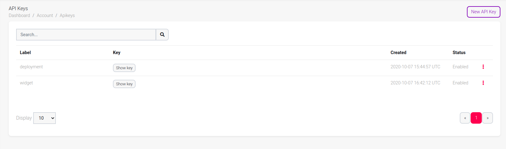

# The ROBO.AI platform - creating bots and API keys for deployment
The Robo AI platform allows you to monitor the usage of your bots, create new ones and generate API keys for deploying a bot in the system.
In this tutorial we will give you an overview of how to accomplish these things. 

## General view 
</img>
 
 
This is the general view you are met with when you log in on the platform. 

The main view shows you some KPIs related with the usage of your bots. Delving into these statistics is out of scope in this tutorial.
On the left sidebar you can navigate to the bots page where you'll see a list of the available bots in your environment and/or create new ones. 

## Bots view
The bots page looks like the image below and it shows you the list of bots in your environment.
</img>
 
 
If you click one of the bots you'll be shown the following panel:
</img>

### Info tab
The Info tab (current one) shows you general information about the bot and allows you to define some additional settings:  
- General Settings: number of minutes a conversation will stay active while idle.
- Conversational Engine: you can check the Runtime status of your bot.
</img>
- Text to Speech: Enable or disable Text to Speech and select engines and speaking rates.
- Speech to Text: Enable or disable Speech to Text and select engines
- Sentiment: Enable or disable sentiment and select engines
 
 

### Analytics tab
The Analytics tab will show you some more KPIs for the specific bot you're checking.
You can also filter and export the data for further analysis.  
</img>

### Logs tab
</img>
 
 
The Logs tab shows you the interactions between bot and users across channels and throughout time. 
It shows you the dialogues by Date/Time and Conversation ID. You're also able to see how the intents are being classified and which entites are being picked up. 
In this page, filtering the logs and export them for further analysis is also an option.

### Test tab
In the test tab you can interact with your bot. This is useful if you want to test your bot before deploying it live, for example.  
</img>

### Channels tab
The Channels tab looks like the image below and it allows you to manage the channels your bot is running on.  
</img>

### Creating a bot
From any of the previous tabs you can click on the "Create New Bot" button to generate a new bot.
When clicking that button you'll be prompted with a pop-up window like the following:

</img>  
In this menu you can assign a name to your bot, enter a description and choose the number of minutes a conversation will stay active while being idle. Only the name of the bot is a mandatory field. The description and Maximum idle conversation time fields can be defined later.
Creating a bot on the Robo AI platform will generate a unique ID which will be used later when you deploy bots. It's important that you remember that this is only an interface to the content of your bot and that this entity must exist before you deploy a bot. 

### Generating API keys
In order to deploy bots you also need to generate and enable an API key first. To do so, click on the Account button on the top right corner. 
One of the available options will be API Keys. If you select that, you'll see the following: 
</img>
These are the available and enabled API keys. If you select "Show key" the key will be visible and you can copy it for your purpose. 

To create a new key select New API Key. You'll be prompted with a pop-up window where you can label your API key.  
<b>Note:</b> When you create a new API Key you must enable it before using it otherwise deployments and other actions will not work. (To enable an API Key, click on the three dots next to "Disabled" and click "Enable").

These are the main features to manage and get around with the Robo AI platform. If you have any doubts don't hesitate to contact us.  